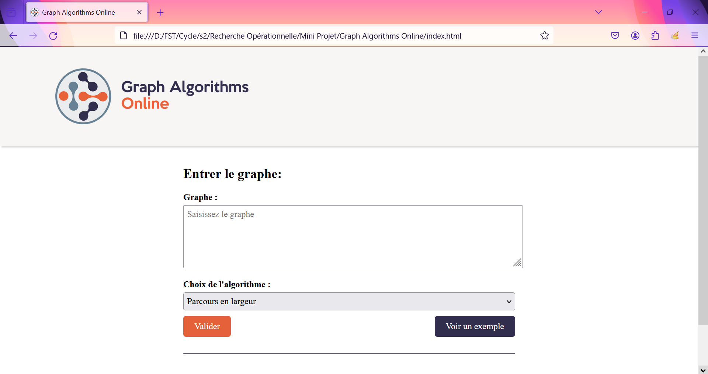
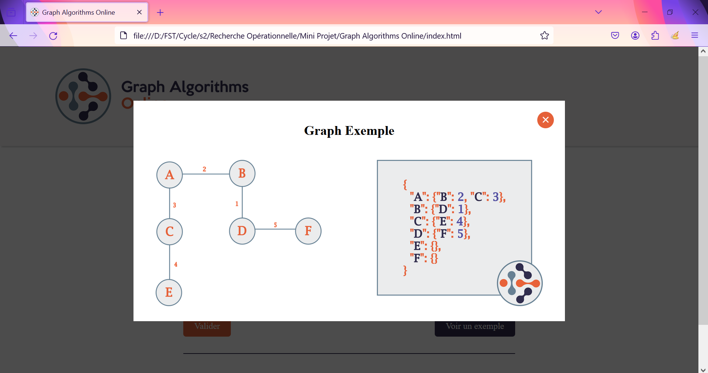
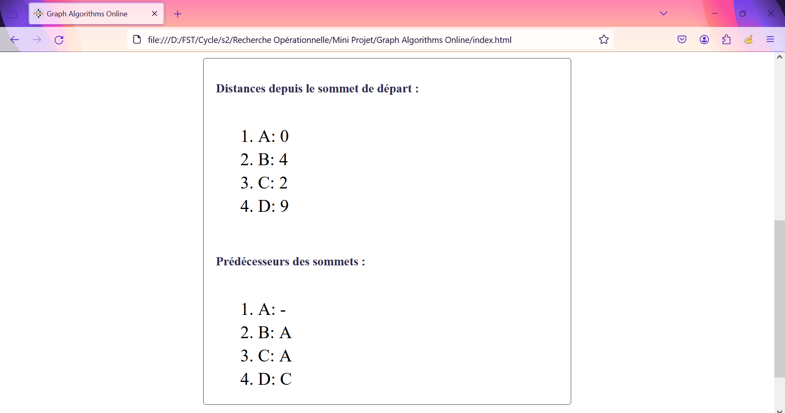

# Graph-Algorithms-Online

<br/>
<p align="center">
  <a href="https://github.com/hamzaezzine/Graph-Algorithms-Online">
    
  </a>

  <h3 align="center">Graph Algorithms Online</h3>

  <p align="center">
    Implementation of 8 Graph Algorithms in JavaScript
    <br/>
    <br/>
    <a href="https://hamzaezzine.github.io/Graph-Algorithms-Online/">View Demo</a>
    .
    <a href="https://github.com/hamzaezzine/Graph-Algorithms-Online/issues">Report Bug</a>
    .
    <a href="https://github.com/hamzaezzine/Graph-Algorithms-Online/issues">Request Feature</a>
  </p>
</p>

   

## Table Of Contents

- [Graph-Algorithms-Online](#graph-algorithms-online)
  - [Table Of Contents](#table-of-contents)
  - [About The Project](#about-the-project)
  - [Algorithms](#algorithms)
  - [Usage](#usage)
  - [Screenshots](#screenshots)
  - [Live Demo](#live-demo)

## About The Project

Graph algorithms play a crucial role in solving problems related to networks, connectivity, and relationships. This website aims to provide a collection of graph algorithms that are suitable for online scenarios.


## Algorithms

The website currently includes implementations for the following graph algorithms:

- Breadth-First Search (BFS)
- Depth-First Search (DFS)
- Gluttonous Coloring Algorithm
- Welsh-Powell Algorithm
- Prim's Algorithm
- Kruskal's Algorithm
- Bellman-Ford Algorithm
- Dijkstra's Algorithm 


## Usage

To use any of the graph algorithms in your project, follow these steps:

1. Clone the repository:

  ```bash
  git clone https://github.com/hamzaezzine/Graph-Algorithms-Online.git
  ```

## Screenshots

- Home Page : 


- Example : 


- Result : 



## Live Demo  
Check the website online : [Graph Algorithms Online](https://hamzaezzine.github.io/Graph-Algorithms-Online/)


